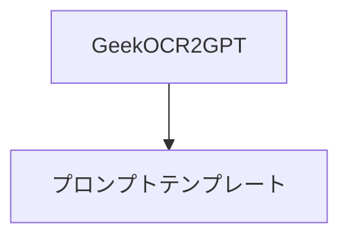

# OCR2GPT

Power Apps キャンバスアプリのAI Builder テキスト認識エンジン(OCR) とGPT でテキストを作成する アクションを組み合わせたドキュメントOCRソリューションです。

# アプリの概要

以下の2オブジェクトで構成されています。

## 利用シナリオ

プロンプトを変更することで任意のフォーマットに対応することができます。

サンプルのプロンプトとして以下の5件が用意されています。

> [!NOTE]
> こちらを参考に他のドキュメントにも適用してみてください。
> できた結果は是非、 [ギークフジワラのXアカウント](https://x.com/Geekfujiwara) までメンションしてご報告ください。

### ガソリン給油レシート

ガソリンの給油レシートから必要な情報を抽出します。

### 家系図提案

戸籍謄本から家系図の提案を行います。

### NDA

機密保持契約書から保持期間などの契約情報を抽出します。

### 請求書

請求書から明細も含めて必要な情報を抽出します。

### 検査成績表

仕入先から届いた検査成績表から必要な情報を抽出します。

#### JSON 形式に出力

それぞれの出力結果は、プロンプトにjsonと加えるだけでjson形式に出力することができます。

> [!NOTE]
> 下流の連携先システムに対して構造化したデータとして利用することができます。

# ソリューションのインポート方法

## 前提条件

AI Builder のGPT アクションが有効なリージョンで利用する必要があります。

AI Builder GPT アクションは、2023年12月時点では米国リージョンで利用することが可能です(パブリック プレビュー)。

> [!NOTE]
> 個人の学習用や開発用環境として米国リージョンの環境を取得することができます。
> 詳細は[こちら](https://learn.microsoft.com/ja-jp/power-apps/maker/maker-create-environment)をご覧ください。

ソリューションは[リリース](https://github.com/geekfujiwara/OCR2GPT/releases)からダウンロードできます。

## インポート方法

[公式ドキュメント](https://learn.microsoft.com/ja-jp/power-apps/maker/data-platform/import-update-export-solutions)を参考にZIPファイル形式のままソリューションをインポートしてください。

## インポート後の警告

この警告は表示言語に関するものです。基本的にはこのまま利用することができます。

## データインポート

ソリューションをインポートした時点ではオブジェクトのみが環境に展開されます。

> [!NOTE]
> アプリを開くことはできますが、ソリューションをインポートしただけではプロンプトテンプレートテーブルにはデータが含まれていません。
> 
> 
> 

データは移行されませんので、データのインポートを行う必要があります。

以下よりプロンプトのサンプルデータをダウンロードしてください。

[mskk_prompttemplates.xlsx](https://github.com/geekfujiwara/OCR2GPT/files/13604097/mskk_prompttemplates.xlsx)

テーブルを開きます。

「Excel からデータをインポートする」を選択します。

サンプルデータはこちらをダウンロードします。

[mskk_prompttemplates.xlsx](https://github.com/geekfujiwara/OCR2GPT/files/13604102/mskk_prompttemplates.xlsx)

アップロードします。

正常にマッピングが完了したら右上のインポートボタンを押します。

完了しますと以下のようになります。右上のXボタンから閉じます。

データのインポート確認のため、ブラウザを一度更新します。

プロンプト名、プロンプトテンプレートを表示します。

マウスオーバーして以下のように表示されていたらデータのインポートに成功しています。

## アプリの実行

キャンバスアプリを開きます。

プロンプトテンプレートのデータがインポートサれていることがわかります。

> [!NOTE]
> ガソリン給油レシートの場合は以下のように選択できます。
> 
> 

### テストドキュメントの読み込み

レシートから情報を取得してみます。

