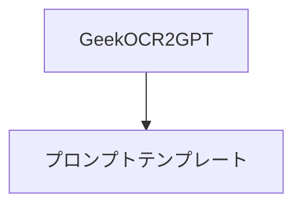

# OCR2GPT
Power Apps キャンバスアプリのAI Builder テキスト認識エンジン(OCR) とGPT でテキストを作成する アクションを組み合わせたドキュメントOCRソリューションです。

# アプリの概要

# ソリューションのインポート方法

## 前提条件
AI Builder のGPT アクションが有効なリージョンで利用する必要があります。

AI Builder GPT アクションは、2023年12月時点では米国リージョンで利用することが可能です(パブリック プレビュー)。

> [!NOTE]
> 個人の学習用や開発用環境として米国リージョンの環境を取得することができます。
> 詳細は[こちら](https://learn.microsoft.com/ja-jp/power-apps/maker/maker-create-environment)をご覧ください。

ソリューションは[リリース](https://github.com/geekfujiwara/OCR2GPT/releases)からダウンロードできます。

こちらをダウンロードするようにしてください。

## インポート後の警告
この警告は表示言語に関するものです。基本的にはこのまま利用することができます。

以下の2オブジェクトで構成されています。

## データインポート
ソリューションをインポートした時点ではオブジェクトのみが環境に展開されます。
データは移行されませんので、データのインポートを行う必要があります。

> [!NOTE]
> アプリを開くことはできますが、ソリューションをインポートしただけではプロンプトテンプレートテーブルにはデータが含まれていません。
> 

テーブルを開きます。

インポートを選択します。

サンプルデータはこちらをダウンロードします。

[mskk_prompttemplates.csv](https://github.com/geekfujiwara/OCR2GPT/files/13603840/mskk_prompttemplates.csv)

アップロードはこちらのようにcsvファイルをドロップします。

サインインします。

> [!NOTE]
> 裏ではcsvファイルをOneDrive にアップロードしてそれをアップロードするためにサインインを行っています。

次へを押します。

プレビュー、その次でも「次へ」を押します。

ウィザードが「データを取得」まで来たら、既存のテーブルに読み込むを選択し、宛先テーブルはmskk_PromptTemplate を選択します。

自動マップを押すと、ソース列が自動的に設定されることを確認します。

次へを押します。

手動で更新として公開します。

> [!NOTE]
> 実行まで時間がかかります。
> データフローで実行されるため、バッチ処理で動くためです。約1分ほどで連携されます。

これにてデータインポートは完了です。

